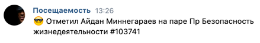
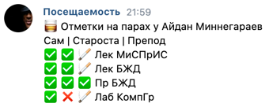

# leti_attendance

Автоматическая отметка посещаемости в ЛЭТИ

## Требования

PHP 8.2, [Composer](https://getcomposer.org/)

## Установка

1. Склонируйте репозиторий
```shell
git clone https://github.com/NolikTop/leti_attendance.git
cd leti_attendance
composer install
```

2. Редактируйте `config.json`. Укажите список пользователей, 
которым надо отмечать посещаемость. 
Также, по желанию, можно указать данные для бота, он сможет 
логировать во ВКонтакте

3. Готово!

## Использование

### Запуск процесса отмечания на парах
Наперед отметить не получится, ровно как и за прошедшие пары.

Поэтому рекомендуется поставить 
запуск скрипта в кроне каждый час с 8 до 18 (либо любое другое время)

```shell
php run.php report
```

При запуске ВК бот (если включен) проинформирует в чат



### Информировать о статусе отметок на парах

Информация пишется в ВК.

Также рекомендуем запускать в кроне в конце дня, 
дабы быть в курсе где вас отметили

```shell
php run.php info
```

